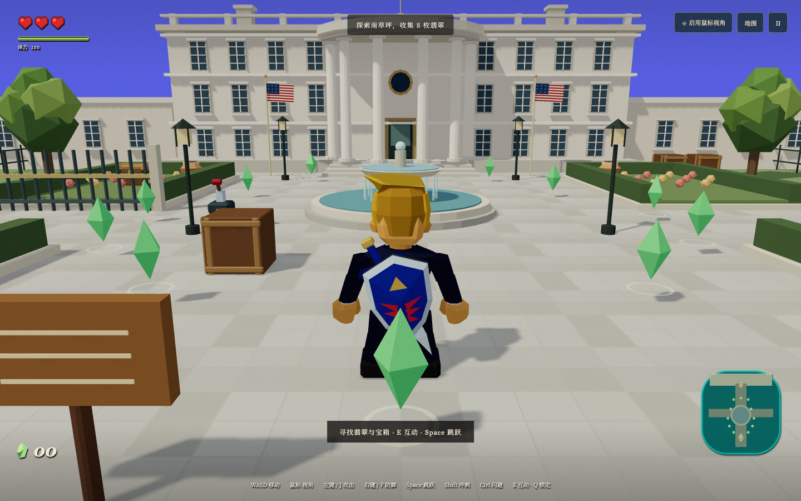
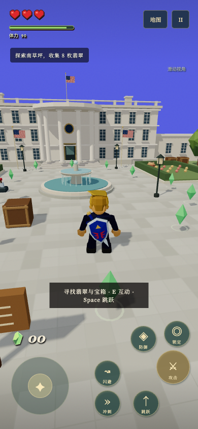
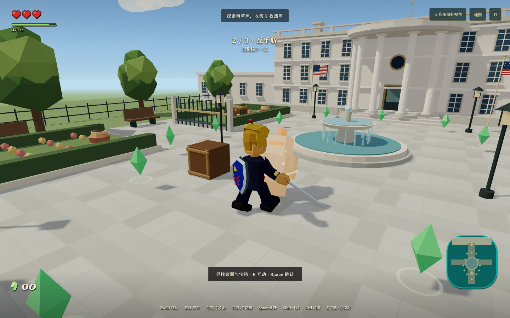
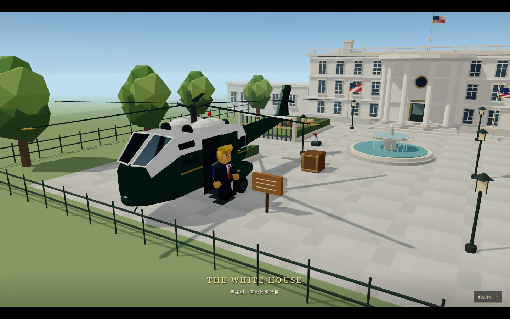
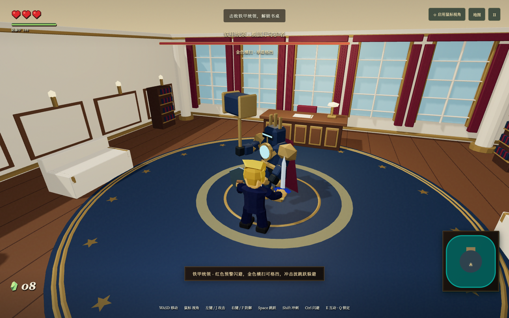

# The Legend of Trump · ホワイトハウスの冒険

[简体中文](README.md) · [繁體中文（香港）](README.zh-HK.md) · [English](README.en.md) · [日本語](README.ja.md) · [한국어](README.ko.md)

**React 19 + Three.js + React Three Fiber + TypeScript + Vite** で制作した、プレイ可能なローポリゴン冒険ゲームです。

参考動画に登場する金髪・スーツ姿の主人公、三人称カメラ、ホワイトハウスの庭と執務室、ハート・宝石・ミニマップをもとに、独立した冒険チャプターを構成しました。タイトルには剣と盾の紋章、金色の文字、模様入りの背景を使用しています。キャラクターや装備は Blender MCP で再制作し、GLB として出力しています。非公式作品であり、参考動画の全編や原作のゲームモデルは同梱していません。音楽は Suno 生成曲と、選択可能な『時のオカリナ』原曲を含みます。[音源情報](public/audio/README.md)を参照してください。


## 起動

Node.js **22.12以降**（または24/26）と、WebGL 2 対応のブラウザーが必要です。

```bash
npm ci
# 設定済みのローカル環境ではポート管理機能を利用：
npm run dev
# 別の環境では空いているポートを指定：
PORT=5173 npm run dev
```

アクセス先はターミナルに表示されます。開発元の環境では `worktree-frontend` ポートプールを使用し、初回の確認先は `http://127.0.0.1:4439/` でした。起動スクリプトは既存の待受プロセスを置き換えません。

```bash
npm run build
PORT=5173 npm run preview
```

`dist/` を静的サイトとして配信できます。サブディレクトリへの配置に対応し、バックエンドは不要です。Google Fonts を利用できない場合はシステムフォントに切り替わります。

## 設定と言語

タイトル画面または一時停止メニューの **「設定」** から、**简体中文 / English / 日本語 / 한국어** を選べます。音声全体のオン・オフ、音楽と効果音の個別音量、Suno／時のオカリナの選曲、カメラ設定にも対応しています。設定はブラウザーに保存されますが、冒険の進行状況は保存されません。両方の音楽セットは `public/audio/` のローカルファイルを再生します。

## 遊び方

1. 南庭を探索し、**宝石を8個** 集めます。噴水の周辺や壺の中を探しましょう。
2. 壺を壊すと宝石を2個獲得できます。木箱も破壊可能です。守衛は予備動作の後に攻撃します。正面で防御するか、回避ロールで避けましょう。通常の守衛は攻撃を受けるとよろめき、後退します。
3. 宝石が集まったらホワイトハウスの正門を調べ、執務室に入ります。
4. 東側の補給箱から弓と矢16本、庭園の宝箱から矢12本を入手できます。Xで武器切替、攻撃長押しで弓を引き、離すと発射。右クリック長押しで狙います。
5. 室内ボス **「鉄甲の統領」** を倒します。金色の薙ぎ払いは防御、赤いハンマー攻撃は回避、衝撃波はジャンプで対処します。体力が半分を下回ると加速し、体力12／6の段階で守衛を召喚します。予告は2.4秒、各波は最大2体、波の間隔は最低14秒です。遠距離にも衝撃波を放ちます。
6. 勝利後、机で冒険宣言に署名してチャプターを完了します。

ハートは3個です。室内で敗北した場合、宝石を保持したままボス部屋の入口で体力を回復して再挑戦できます。一時停止中はシミュレーションが止まり、ウィンドウがフォーカスを失った場合も自動停止します。単一チャプター・セッション単位のゲームで、進行の自動保存はありません。

| 操作 | キー |
| --- | --- |
| カメラ基準で移動 | WASD / 矢印キー |
| 視点 / ズーム | 左クリックで攻撃とマウス固定、ホイールで距離調整。固定不可時は中ボタンドラッグ |
| ジャンプ / ダッシュ | Space / Shift長押し |
| 攻撃 / 溜め | 左クリック / J、長押しで溜め |
| 防御 / 弓の照準 | 右クリック / F長押し |
| 回避 / ロックオン | CtrlまたはK / Q |
| 武器 / 対象切替 | X / Tab |
| 調べる | E / 画面の操作表示をクリック |
| カメラリセット / 一時停止 | R / Esc（マウス固定も解除） |

剣と盾は未使用時に背中へ収納されます。攻撃時は右手に剣、防御時は左手に盾を持ちます。ダッシュ、攻撃、回避、防御で受けた衝撃はスタミナを消費します。通常のジャンプは消費せず、行動を止めるとスタミナが回復します。

攻撃を続けて入力すると **縦斬り → 左から右への横斬り → 右から左への横斬り** がつながります。消費スタミナは8／9／12。開始約0.035秒後から次の1段を先行入力でき、最初の2段には終了後0.34秒の継続受付があります。最後の攻撃には追加の硬直があります。スタミナ不足では攻撃せず、回避するとコンボを中断します。

肩・肘・手首・腰・膝の連動で剣を振り、命中時に短いヒットストップ、剣閃、火花、効果音、敵ののけぞり、カメラ振動を発生させます。通常攻撃の敵硬直は約0.56〜0.60秒、最終段は約0.95秒です。吹き飛ばしは障害物を貫通しません。

攻撃を長押しすると最初に斬り、その後溜めに入ります。1.2秒で金色の輪と音が出て、離すと360度の回転斬りになります。消費26、半径3.8メートルで、壁による遮蔽判定があります。早い解放、被弾、回避、ジャンプ、一時停止、タッチ取消で溜めを中断します。

弓は1射につき矢1本とスタミナ10を消費し、0.85秒で最大溜め、発射間隔は最低0.48秒です。通常／最大溜めのダメージは1／2。ボスへの追加ダメージは硬直または召喚中のみです。矢は連続線分で衝突判定し、壁や家具で止まります。守衛は矢3本とスタミナ補給を落とし、室内再挑戦時は最低12本を確保します。矢切れでも剣で戦えます。

照準は敵の胸元に追従し、体力を表示します。Qでロック切替、Tabまたは上部ボタンで対象変更。対象死亡時は近くの生存敵を選びます。マウス移動だけでは解除されず、距離変化には猶予があります。近距離照準時は主人公を半透明にして視界を確保します。

スマホでは左スティックで移動、大きく倒すとダッシュ、右側のスワイプで視点を操作します。攻撃・防御・ジャンプ・回避のコンパクトなボタンに加え、HUDから武器や対象を切り替えます。弓装備時は防御が照準に変わります。マルチタッチに対応し、指を離すか操作を取り消すと長押し状態を解除します。

カメラ設定は距離5〜14、視野55〜80度、感度0.4〜2倍、上下反転、命中時の振動に対応し、初期化できます。縦画面では視野を拡張します。壁際でカメラを縮め、離れると滑らかに戻します。低い家具は上から見越し、必要に応じて主人公をフェードさせます。[Epicのカメラ／Spring Arm資料](https://dev.epicgames.com/documentation/en-us/unreal-engine/camera-components?application_version=4.27)を参考にしています。

宝箱、レバー、回復草、告示、ベンチ、木箱を調べられます。宝箱と回復草の報酬は一度だけです。建物、木、噴水、花壇、家具、道具、敵に衝突判定があり、台へのジャンプ、端からの落下、壁沿いの移動、攻撃・操作の遮蔽判定に対応します。





## 構成

| パス | 役割 |
| --- | --- |
| `src/game/simulation.ts` | 移動・衝突・戦闘・収集・進行状態 |
| `src/game/combat.ts` | 命中タイミングと関節姿勢 |
| `src/game/input.ts` | キーボード・マウス・スティック・フォーカス |
| `src/game/world.ts`, `collision.ts` | 操作位置・衝突体・着地・遮蔽 |
| `src/game/audio.ts`, `music.ts` | 合成効果音と音楽再生 |
| `src/game/i18n.ts`, `translations.json` | 言語切替と翻訳 |
| `src/components/SettingsPanel.tsx` | 言語・音量・カメラ設定 |
| `src/components/RangedCombat.tsx` | 照準・矢・召喚予告・補給 |
| `src/components/InteractiveProps.tsx` | 操作可能な道具とアニメーション |
| `src/components/Character.tsx` | GLBとキャラクター動作 |
| `src/components/Scene.tsx`, `World.tsx` | シーン・カメラ・環境 |
| `src/components/Hud.tsx`, `src/App.tsx` | HUD・タッチ・メニュー・進行画面 |

高頻度の状態はシミュレーションに保持し、DOMの更新頻度を抑えています。人物とカメラは `useFrame` で同期し、大きいフレーム間隔は分割します。テスト用の `window.__game`、`window.__scene`、`window.__camera` は開発環境だけに公開されます。

## 検証

```bash
npm test
npm run build
# 別ターミナルで開発サーバーを起動してから実行：
GAME_URL=http://127.0.0.1:4439 npm run test:e2e
```

移動、連続衝突、着地、カメラ避障、攻撃方向、遮蔽、報酬、防御、回避、スタミナ、コンボ、ボス戦、再挑戦をテストします。ブラウザーテストは装備姿勢、マウス固定、タッチ操作、クリアまでの流れを対象にします。一部は開発用APIで開始位置を設定してから実入力を使い、草坪を瞬間移動せず走破するテストもあります。

画像は `artifacts/` に保存されます。Playwrightは通常ローカルChromeを使用します。Chromiumを使う場合は `npx playwright install chromium` を実行し、`BROWSER_CHANNEL=chromium` を設定してください。モバイル検証には390 × 844画面、同時タッチ、取消時の後始末、横スクロールの確認を含みます。

## Blender素材

- `assets/blender/build_trump.py` / `trump-n64.blend`：金髪、スーツ、赤いネクタイ、旗のピン、名前付き関節を備える主人公。出力は `public/models/trump-n64.glb`。
- `build_adventure_props.py` / `adventure-props.blend`：剣、盾、宝箱、レバー、木箱、回復草。`hero-*.glb`、`adventure-*.glb` を出力。
- `build_bow.py` / `adventure-bow.blend`：弓、矢筒、矢。
- `build_enemies_arena.py` / `enemies-arena.blend`：守衛、統領、室内と家具。
- `build_arrival_helicopter.py` / `arrival-helicopter.blend`：ドア、搭乗ステップ、脚、ローターを備えるヘリ。
- `public/title-screen.jpg`：参考動画から切り出したタイトル画像。レイヤー素材と出典は `public/title/`。

Blenderで `TRUMP_PROJECT_DIR` にプロジェクトの絶対パスを設定してスクリプトを実行します。独立したシーンで作業し、既存の制作物を保ちます。`npm run assets:optimize` で glTF Transform の重複除去・頂点結合・整理を実行できます。





スキップ可能な登場演出では、ドア、ステップ、降機、カメラを同期します。エンジンとローター音は接近・離脱に合わせて変化します。ヘリの外形は[米空軍公開のMarine One写真](https://www.jba.af.mil/News/Photos/igphoto/2000075518/)を参考にしています。

## 鉄甲の統領と執務室

[敵と室内のコンセプト](assets/concepts/enemies-and-oval-arena.png)から、守衛と統領、胡桃色の床、象牙色の壁板、大窓、赤いカーテン、金縁の絨毯と家具を制作しました。拡張した部屋の中央には戦闘空間を確保し、本棚、ソファ、柱、机に衝突体を設けています。ボスは予備動作中にひるみにくく、攻撃後に隙が生まれます。地面の予兆、体力バー、ロックオン、再挑戦に対応しています。



参考動画では戦闘・収集の全ルールが示されていないため、必要な宝石数、報酬、敵、クリア条件は本プロジェクトで追加した設計です。スクリーンショットには以前の開発版が含まれる場合があります。
