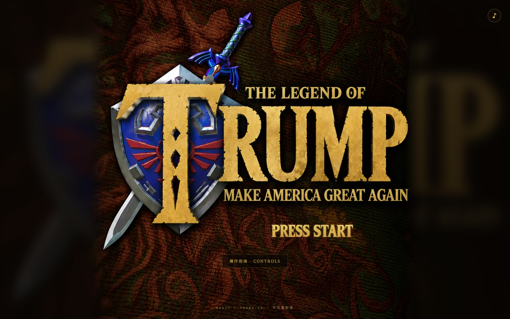
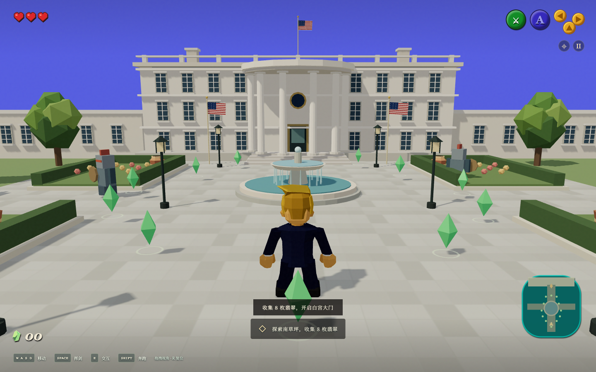
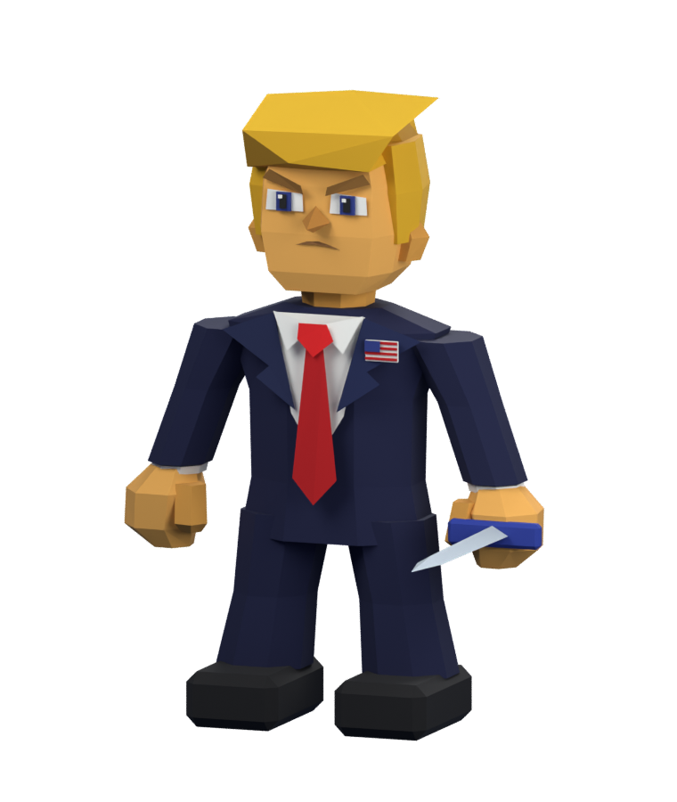

# The Legend of Trump · 白宫奇遇记

基于 **React 19 + Three.js + React Three Fiber + TypeScript + Vite** 的可玩低多边形冒险游戏。

参考提供的视频中的金发西装角色、第三人称视角、白宫外景与办公室、爱心／翡翠／小地图界面，制作了一个可独立运行的冒险章节。标题页直接使用用户提供视频的标题帧，保留原剑盾 Logo、金色字形和暗纹背景。人物通过 Blender MCP 重新建模并导出 GLB，场景与音效由代码生成；没有打包整段原视频、原游戏模型或原游戏音乐。



## 启动

需要 Node.js 22.12+（或 24/26）及支持 WebGL 2 的现代浏览器。

```bash
npm ci
# 在本机工作区自动调用端口管理器分配端口：
npm run dev
# 在其他机器上，明确指定一个空闲端口：
PORT=5173 npm run dev
```

终端会打印实际访问地址。当前开发环境使用端口管理器的 `worktree-frontend` 池，首次验证地址为 `http://127.0.0.1:4439/`。启动脚本不覆盖已有监听进程。

```bash
npm run build
PORT=5173 npm run preview
```

`dist/` 是可部署的静态站点。资源使用相对路径，可放在子目录中。游戏无需后端；Google Fonts 不可用时使用系统字体回退。

## 玩法

1. 在南草坪收集 **8 枚翡翠**。沿喷泉两侧探索，陶罐中也有翡翠。
2. 挥剑击碎陶罐，每个陶罐获得 2 枚翡翠。发条守卫需要两次命中，接触会消耗爱心。
3. 集齐后到白宫大门前交互，进入椭圆形办公室。
4. 走近书桌并签署冒险宣言，完成章节。

三颗爱心耗尽后可以重试；暂停时模拟停止，窗口失焦自动暂停。当前为单章节、单次会话游戏，无自动存档。

| 操作        | 键位                 |
| ----------- | -------------------- |
| 移动        | WASD / 方向键        |
| 奔跑        | 按住 Shift           |
| 挥剑        | Space / J            |
| 交互        | E / 点击屏幕交互提示 |
| 环绕视角    | 在场景内按住鼠标拖动 |
| 复位视角    | R                    |
| 暂停 / 继续 | Esc                  |

手机和平板支持虚拟摇杆及挥剑、交互按钮。右上角按钮可暂停游戏和折叠地图，暂停菜单中可关闭音效。



## 项目结构

- `src/game/simulation.ts`：独立于渲染器的移动、碰撞、战斗、收集和任务状态机。
- `src/game/input.ts`：键盘映射、摇杆状态和失焦处理。
- `src/game/audio.ts`：用户手势激活后的 Web Audio 合成音效。
- `src/components/World.tsx`：白宫建筑、花园、喷泉与办公室。
- `src/components/Character.tsx`：Blender GLB 加载，以及行走、挥剑和坐姿书写动画。
- `src/components/Scene.tsx`：R3F 场景、相机、实体同步及模拟步进。
- `src/components/Hud.tsx`：DOM 界面、小地图及触屏操作。
- `src/App.tsx`：标题、暂停、指南、对话和结算。

高频游戏状态保存在模拟实例中，DOM 以低频率刷新，角色和相机通过 `useFrame` 同步。模拟对大帧间隔分步处理，避免穿透与明显的低帧率减速。为了方便本地端到端测试，仅开发环境暴露 `window.__game`，生产构建不暴露。

## 验证

```bash
npm test
npm run build
# 先在另一终端启动开发服务器；默认使用本机 Chrome：
GAME_URL=http://127.0.0.1:4439 npm run test:e2e
```

- 单元测试覆盖移动、暂停、碰撞、拾取幂等、入口解锁、攻击方向与冷却、死亡与重开。
- Playwright 覆盖桌面标题、键盘移动、攻击陶罐、收集、进入办公室、签署、通关和重开。
- 移动端验证 390 × 844 视口、摇杆移动、操作按钮和页面无横向溢出。
- 测试中用开发接口设置中间场景位置，随后通过真实输入与模拟验证交互，并非全程自动寻路。
- 截图保存在 `artifacts/`。测试配置默认使用本机 Chrome，也可设置 `BROWSER_CHANNEL=chromium` 并先执行 `npx playwright install chromium`。

视频中没有展示完整收集和战斗规则；陶罐奖励、发条守卫、翡翠门槛和通关条件是本项目为构成可玩流程添加的设计。画面按照视频改为饱和蓝天、低多边形人物和 N64 风格的红心、绿／蓝／黄色操作按钮。本项目为非官方创作。

## Blender 模型与素材

- `assets/blender/trump-n64.blend`：独立的人物建模源文件。
- `assets/blender/build_trump.py`：可复现的 Blender 建模脚本，包含棱面头部、金发、面部五官、西装红领带、旗帜胸针和独立四肢轴。
- `public/models/trump-n64.glb`：约 85 KB，7 个网格对象、约 1,142 个三角形，保留可动画的命名轴；无外部纹理依赖。
- `public/title-screen.jpg`：从用户提供视频第 2 秒提取的标题画面，作为静态标题页素材。

重建时在 Blender 中设置 `TRUMP_PROJECT_DIR` 环境变量为项目绝对路径，再运行建模脚本。脚本创建独立场景，仅导出当前人物场景，保留现有 Blender 工程。随后在项目目录执行 `npm run assets:optimize`，通过 glTF Transform 去重、焊接和清理。

验证记录：7 项单元／资产测试及 2 项浏览器测试通过；包含无瞬移的完整草坪路线验证。


